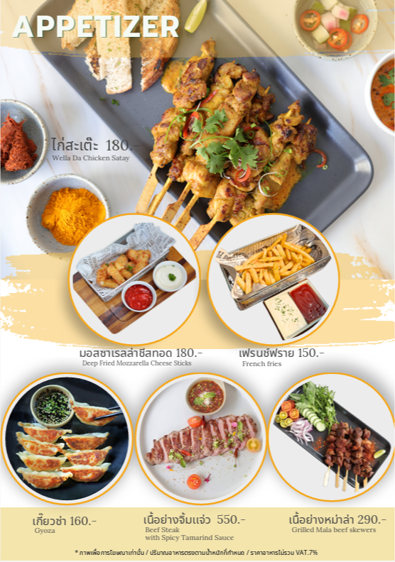
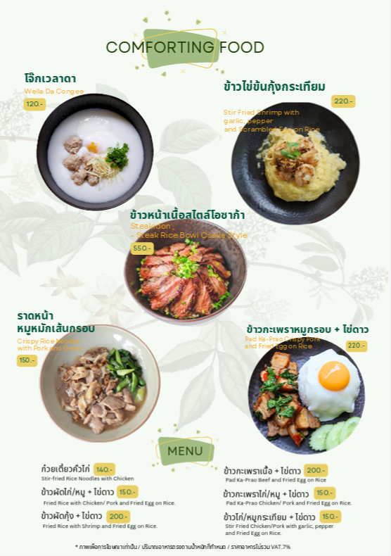
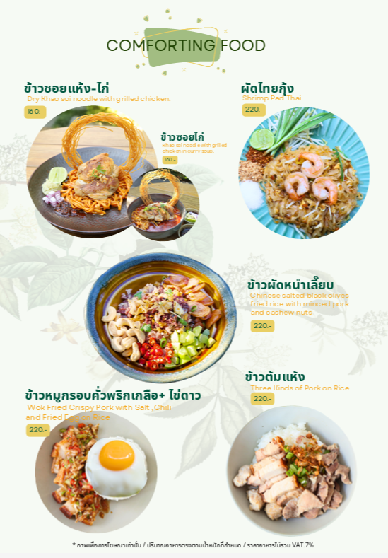
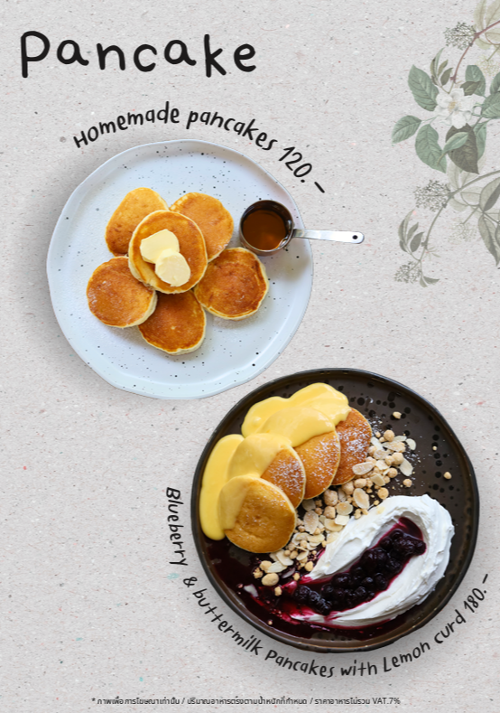
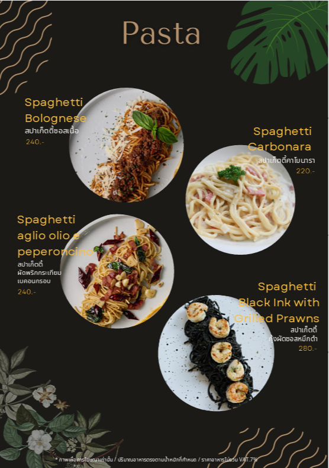
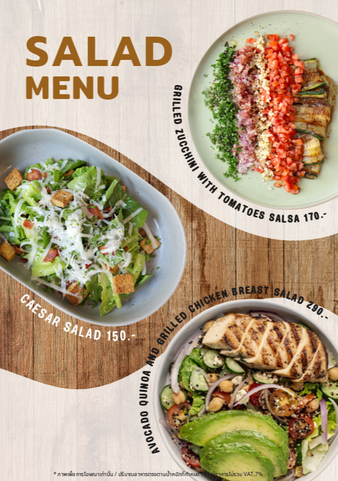
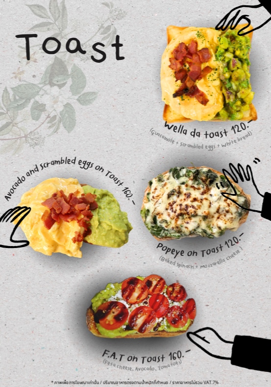
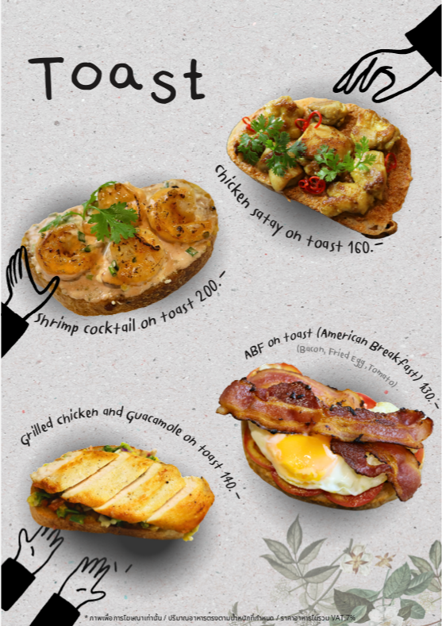

<!DOCTYPE html>
<html lang="th">
<head>
    <meta charset="UTF-8">
    <meta name="viewport" content="width=device-width, initial-scale=1.0">
    <title>ร้านอาหารเช้า & อาราคัต</title>
    
    
</head>
<body class="bg-gray-50">
    <!-- Header -->
    <header class="gradient-bg text-white py-6 shadow-lg">
        

            <h1 class="text-4xl font-bold text-center">🍳 ร้านอาหารเช้า & อาราคัต 🥘</h1>
            
อาหารเช้า 7:00-10:00 น. | อาราคัต ตลอดวัน | Room Service 9:00-18:00 น.

        

    </header>

    <!-- Navigation -->
    <nav class="bg-white shadow-md sticky top-0 z-50">
        

            

                <button onclick="showSection('breakfast')" id="breakfast-tab" class="px-6 py-3 rounded-full font-semibold transition-all active-tab">
                    🌅 อาหารเช้า
                </button>
                <button onclick="showSection('alacarte')" id="alacarte-tab" class="px-6 py-3 rounded-full font-semibold transition-all bg-gray-200 text-gray-700 hover:bg-gray-300">
                    🍽️ อาราคัต
                </button>
            

        

    </nav>

    <!-- Main Content -->
    <main class="container mx-auto px-4 py-8">
        <!-- Breakfast Section -->
        

            

                <h2 class="text-3xl font-bold text-gray-800 mb-4">🌅 เมนูอาหารเช้า</h2>
                

                    
⏰ สั่งได้ตั้งแต่ 7:00-10:00 น. (หลัง 10:00 น. จะเป็นออเดอร์วันพรุ่งนี้)

                

            

            

                <!-- Breakfast Menu Images -->
                

                    

                        <h3 class="text-xl font-bold text-gray-800 mb-4 border-b pb-2">📋 หมวดที่ 1: อาหารเช้า</h3>
                        

                            

                                

                                    
🍚

                                    ข้าวต้มหมู
                                

                                45 บาท
                            

                            

                                

                                    
🥣

                                    โจ๊กหมู
                                

                                40 บาท
                            

                            

                                

                                    
🍳

                                    ข้าวผัดอเมริกัน
                                

                                55 บาท
                            

                            

                                

                                    
🍞

                                    ขนมปังปิ้งเนยนม
                                

                                35 บาท
                            

                            

                                

                                    
🥚

                                    ไข่เจียวข้าว
                                

                                30 บาท
                            

                        

                    

                    

                        <h3 class="text-xl font-bold text-gray-800 mb-4 border-b pb-2">🥤 หมวดที่ 2: เครื่องดื่ม</h3>
                        

                            

                                

                                    
☕

                                    กาแฟร้อน
                                

                                25 บาท
                            

                            

                                

                                    
🧊

                                    ชาเย็น
                                

                                20 บาท
                            

                            

                                

                                    
🍊

                                    น้ำส้มคั้น
                                

                                30 บาท
                            

                        

                    

                    

                        <h3 class="text-xl font-bold text-gray-800 mb-4 border-b pb-2">🍎 หมวดที่ 3: ผลไม้</h3>
                        

                            

                                

                                    
🍍

                                    สับปะรดหั่น
                                

                                25 บาท
                            

                            

                                

                                    
🍉

                                    แตงโมหั่น
                                

                                20 บาท
                            

                        

                    

                

                <!-- Breakfast Order Form -->
                

                    <h3 class="text-xl font-bold text-gray-800 mb-4 border-b pb-2">🛒 รายการสั่งอาหารเช้า</h3>
                    

                        
ยังไม่มีรายการอาหาร

                    

                    

                        

                            รวมทั้งหมด:
                            0 บาท
                        

                        <form id="breakfast-order-form" class="space-y-4">
                            

                                <label class="block text-sm font-medium text-gray-700 mb-1">เลขห้อง *</label>
                                <input type="text" id="breakfast-room" required class="w-full px-3 py-2 border border-gray-300 rounded-lg focus:ring-2 focus:ring-purple-500 focus:border-transparent">
                            

                            

                                <label class="block text-sm font-medium text-gray-700 mb-1">วิธีการรับอาหาร *</label>
                                <select id="breakfast-delivery" required class="w-full px-3 py-2 border border-gray-300 rounded-lg focus:ring-2 focus:ring-purple-500 focus:border-transparent">
                                    <option value="">เลือกวิธีการรับ</option>
                                    <option value="ทานที่ร้าน">ทานที่ร้าน</option>
                                    <option value="Room Service">Room Service</option>
                                </select>
                            

                            

                                <label class="block text-sm font-medium text-gray-700 mb-1">หมายเหตุ</label>
                                <textarea id="breakfast-note" rows="3" class="w-full px-3 py-2 border border-gray-300 rounded-lg focus:ring-2 focus:ring-purple-500 focus:border-transparent" placeholder="ระบุความต้องการพิเศษ..."></textarea>
                            

                            <button type="submit" class="w-full gradient-bg text-white py-3 rounded-lg font-semibold hover:opacity-90 transition-opacity">
                                📤 ส่งออเดอร์อาหารเช้า
                            </button>
                        </form>
                    

                

            

        

        <!-- A la carte Section -->
<!-- A la carte Section -->

    

        <h2 class="text-3xl font-bold text-gray-800 mb-4">🍽️ เมนูอาราคัต</h2>
        
เปิดบริการตลอดวัน | Room Service 9:00-18:00 น.

    

    

        <!-- ฝั่งซ้าย: เลือกหมวด + แสดงเมนู -->
        

            <!-- Category Selection -->
            

                <h3 class="text-xl font-bold text-gray-800 mb-4 border-b pb-2">📂 เลือกหมวดอาหาร</h3>
                

                    <button onclick="showAlacarteCategory('Toast')" class="alacarte-category-btn p-4 border-2 border-gray-200 rounded-lg hover:border-purple-500 hover:bg-purple-50 transition-all text-center">
                        

                        
Toast

                    </button>
                    <button onclick="showAlacarteCategory('Com forting food')" class="alacarte-category-btn p-4 border-2 border-gray-200 rounded-lg hover:border-purple-500 hover:bg-purple-50 transition-all text-center">
                        

                        
Com forting food

                    </button>
                    <button onclick="showAlacarteCategory('Sarad')" class="alacarte-category-btn p-4 border-2 border-gray-200 rounded-lg hover:border-purple-500 hover:bg-purple-50 transition-all text-center">
                        

                        
Sarad

                    </button>
                    <button onclick="showAlacarteCategory('Pasta')" class="alacarte-category-btn p-4 border-2 border-gray-200 rounded-lg hover:border-purple-500 hover:bg-purple-50 transition-all text-center">
                        

                        
Pasta

                    </button>
                    <button onclick="showAlacarteCategory('Appetizer')" class="alacarte-category-btn p-4 border-2 border-gray-200 rounded-lg hover:border-purple-500 hover:bg-purple-50 transition-all text-center">
                        

                        
Appetizer

                    </button>
                    <button onclick="showAlacarteCategory('Pancake')" class="alacarte-category-btn p-4 border-2 border-gray-200 rounded-lg hover:border-purple-500 hover:bg-purple-50 transition-all text-center">
                        

                        
Pancake

                    </button>
                

            

            <!-- Menu Items Display -->
            

                <h3 id="alacarte-category-title" class="text-xl font-bold text-gray-800 mb-4 border-b pb-2"></h3>
                

            

        

        <!-- ฝั่งขวา: Slide รูปภาพ -->
        

    <h3 class="text-xl font-bold text-gray-800 mb-4 border-b pb-2 text-center">🖼️ ตัวอย่างเมนูอาราคัต</h3>
    
    <!-- Main Image -->
    

        
    

    <!-- Thumbnails -->
    

        
        
        
        
        
        
        
        

        
    

    

                <!-- A la carte Order Form -->
                

                    <h3 class="text-xl font-bold text-gray-800 mb-4 border-b pb-2">🛒 รายการสั่งอาราคัต</h3>
                    

                        
ยังไม่มีรายการอาหาร

                    

                    

                        

                            รวมทั้งหมด:
                            0 บาท
                        

                        <form id="alacarte-order-form" class="space-y-4">
                            

                                <label class="block text-sm font-medium text-gray-700 mb-1">เลขห้อง *</label>
                                <input type="text" id="alacarte-room" required class="w-full px-3 py-2 border border-gray-300 rounded-lg focus:ring-2 focus:ring-purple-500 focus:border-transparent">
                            

                            

                                <label class="block text-sm font-medium text-gray-700 mb-1">วิธีการรับอาหาร *</label>
                                <select id="alacarte-delivery" required class="w-full px-3 py-2 border border-gray-300 rounded-lg focus:ring-2 focus:ring-purple-500 focus:border-transparent">
                                    <option value="">เลือกวิธีการรับ</option>
                                    <option value="ทานที่ร้าน">ทานที่ร้าน</option>
                                    <option value="Room Service">Room Service</option>
                                </select>
                            

                            

                                <label class="block text-sm font-medium text-gray-700 mb-1">หมายเหตุ</label>
                                <textarea id="alacarte-note" rows="3" class="w-full px-3 py-2 border border-gray-300 rounded-lg focus:ring-2 focus:ring-purple-500 focus:border-transparent" placeholder="ระบุความต้องการพิเศษ..."></textarea>
                            

                            <button type="submit" class="w-full gradient-bg text-white py-3 rounded-lg font-semibold hover:opacity-90 transition-opacity">
                                📤 ส่งออเดอร์อาราคัต
                            </button>
                        </form>
                    

                

            

        

    </main>

    <!-- Success Modal -->
    

        

            
✅

            <h3 class="text-2xl font-bold text-gray-800 mb-2">ส่งออเดอร์สำเร็จ!</h3>
            
ออเดอร์ของคุณได้ถูกส่งไปยังครัวแล้ว

            <button onclick="closeSuccessModal()" class="gradient-bg text-white px-6 py-3 rounded-lg font-semibold hover:opacity-90 transition-opacity">
                ตกลง
            </button>
        

    

    
</body>
</html>
